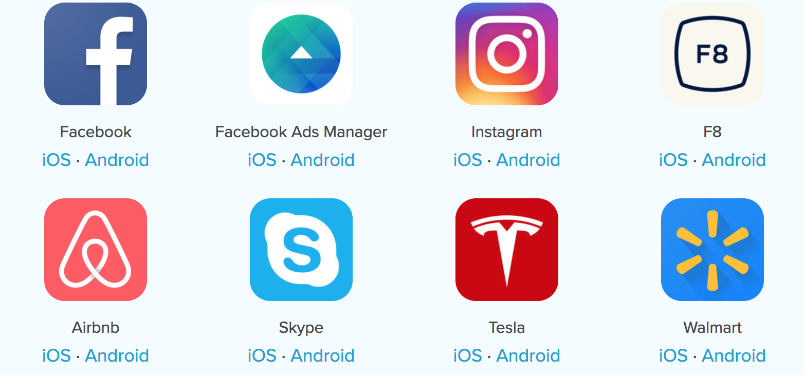

## What is React Native?


### Intro

- Build mobile apps using JavaScript
- Facebook Open Source
- **Learn Once, Write Anywhere**

<br>
Documentation: https://facebook.github.io/react-native/


### Misconception

Does the JS compile to native code? **No.**

<br>
<br>
JavaScript
➡️
Bridge
➡️
Native code


### React Native in Action (iOS)

``` javascript.player.ios
import React from 'react';
import { AppRegistry, Button, Text, View } from 'react-native';

const Counter = ({ value }) => (
  <Text>State value is: {value}</Text>
);

class App extends React.Component {
  constructor(props) {
    super(props);

    this.state = { value: 42 };
  }

  handleOnClick = () => {
    this.setState(prevState => ({ value: prevState.value + 1 }));
  }

  render() {
    return (
      <View style={{ fontSize: '1.2em', margin: '1em' }}>
        <Counter value={this.state.value} />

        <Button onPress={this.handleOnClick} title="INCREMENT" />
      </View>
    );
  }
}

AppRegistry.registerComponent('App', () => App);
```


### React Native in Action (Android)

``` javascript.player.android
import React from 'react';
import { AppRegistry, Button, Text, View } from 'react-native';

const Counter = ({ value }) => (
  <Text>State value is: {value}</Text>
);

class App extends React.Component {
  constructor(props) {
    super(props);

    this.state = { value: 42 };
  }

  handleOnClick = () => {
    this.setState(prevState => ({ value: prevState.value + 1 }));
  }

  render() {
    return (
      <View style={{ fontSize: '1.2em', margin: '1em' }}>
        <Counter value={this.state.value} />

        <Button onPress={this.handleOnClick} title="INCREMENT" />
      </View>
    );
  }
}

AppRegistry.registerComponent('App', () => App);
```


### Flexbox

``` javascript.player.ios
import React from 'react';
import { AppRegistry, View } from 'react-native';

class App extends React.Component {
  render() {
    return (
      // flexDirection: 'row' | 'column'
      <View style={{flex: 1, flexDirection: 'row'}}>
        <View style={{flex: 1, backgroundColor: 'blue'}} />
        <View style={{flex: 1, backgroundColor: 'white'}} />
        <View style={{flex: 1, backgroundColor: 'red'}} />
      </View>
    );
  }
}

AppRegistry.registerComponent('App', () => App);
```


### A React Native app is a real mobile application.


### Who?




### What else?

Remember the similar slide about React? 😎

**+**

- [Universal Windows
  Platform](https://github.com/Microsoft/react-native-windows) by Microsoft
- [Plenty of third-party
  components/bridges](http://www.awesome-react-native.com/)
- An ever-growing community


### One more thing: [CodePush](https://microsoft.github.io/code-push/)

A service by Microsoft to automatically push (OTA) updates to your mobile
applications.

Skip the submission to Google Play/App Store 🚀
